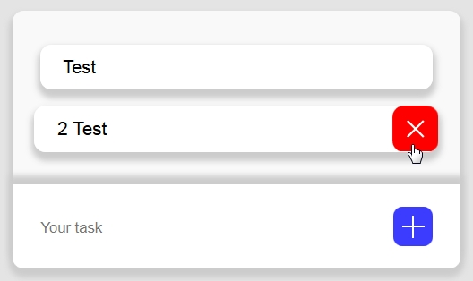

# To-Do-List-jquery
Ссылка: https://alexaltrex.github.io/To-Do-List-jquery

## Описание
Планировщик задач

## Запуск проекта:
1. Клонирование и запуск: git clone https://github.com/Alexaltrex/To-Do-List-jquery.git;
2. Переход в директорию с проектом: cd To-Do-List-jquery;
3. Запуск файла index.html;

## Цель проекта
* Изучение jQuery

## Разработка
* Код - jQuery v.3.4.1;
* Верстка - предпроцессор SASS (конкретно SCSS);
